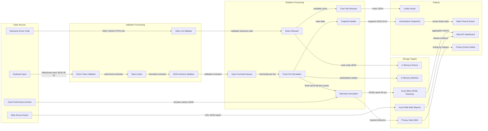
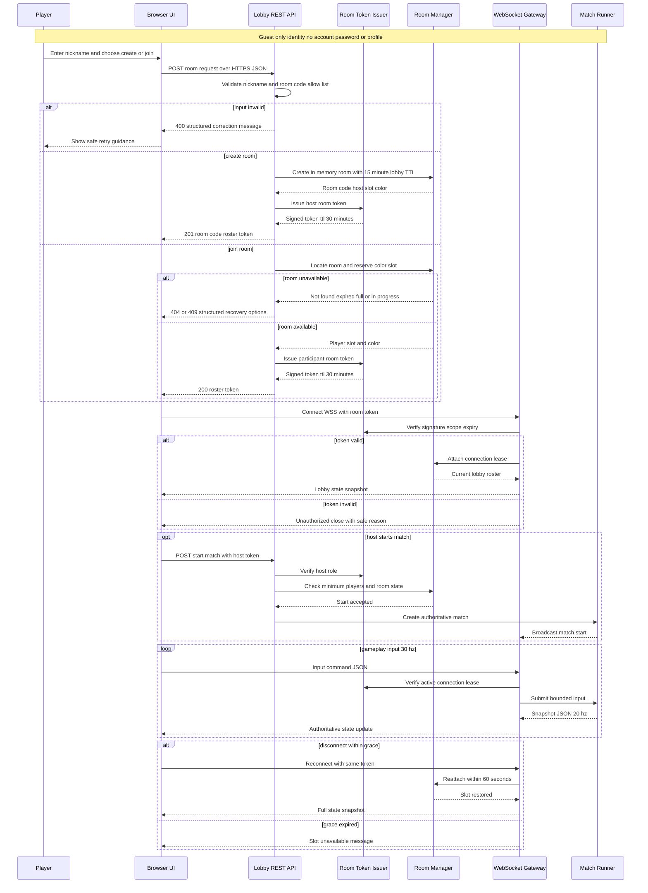
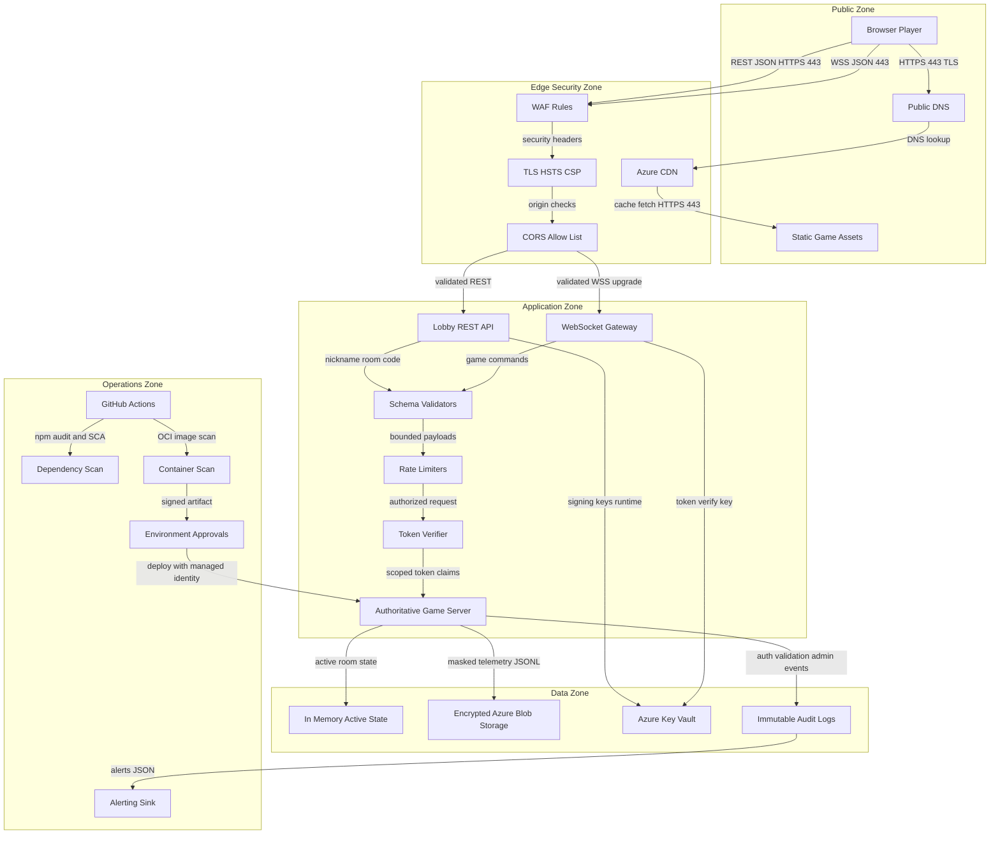
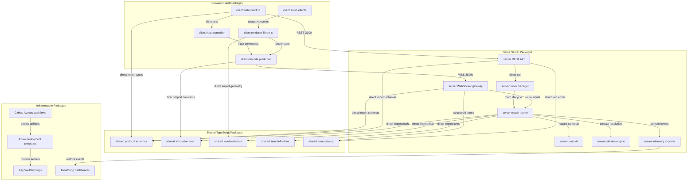
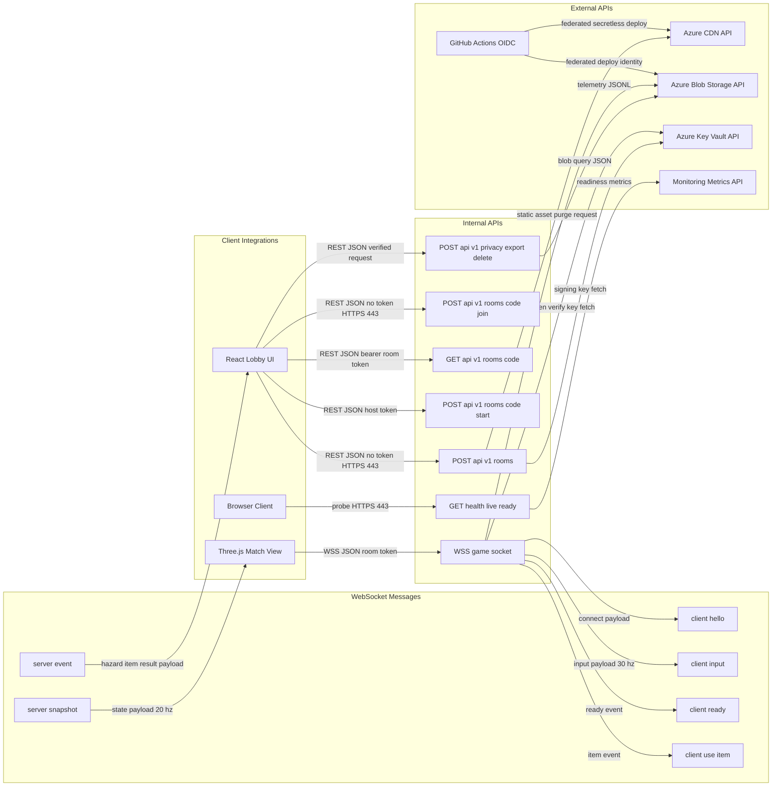
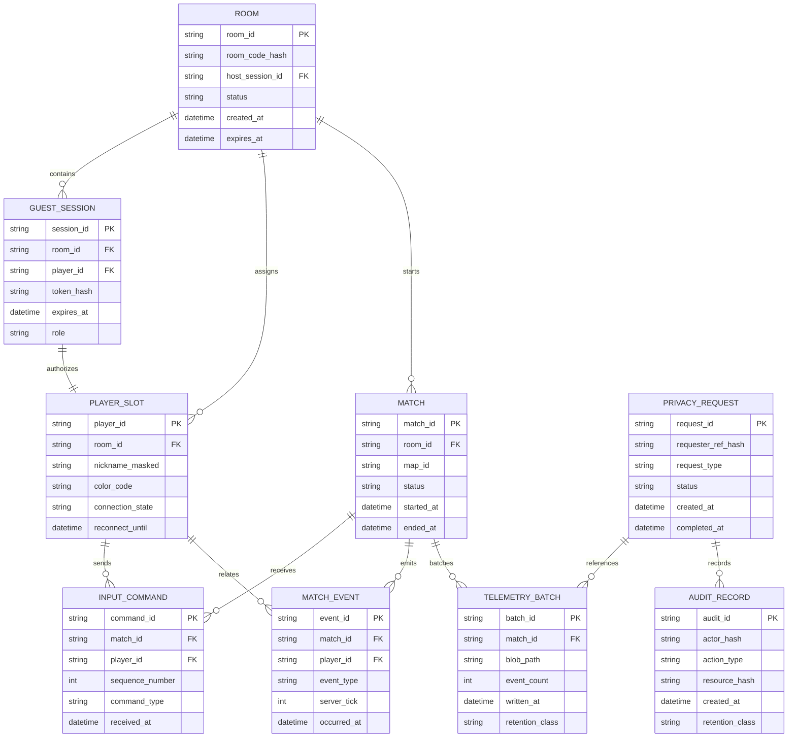

---

**Changelog** (2026-09-29T10:57:31.639Z): Architecture: 9 retained, 4 enhanced.

- Enhanced: Architecture Executive Summary
- Enhanced: Component Architecture
- Enhanced: Technology Stack Summary
- Enhanced: Architectural Concerns & Recommendations

## Architecture Executive Summary

### Project Context
Donkey Trump Race is a greenfield consumer browser game in the real-time multiplayer arcade domain. The product goal is a no-install, humorous, short-session 3D game where up to 5 players join by room code and nickname, control distinct colored Jumpman Løkke characters, traverse a Donkey Kong-style vertical map, avoid a computer-controlled boss that launches barrels, shove opponents, collect power-ups, and race to rescue Motzfeldt. The MVP is explicitly a closed-beta release with one playable map, guest-only identity, GDPR-only privacy scope, and an explicit sign-off gate before public launch.

The proposed architecture uses a browser client, a single-region authoritative Node.js game server, WebSocket gameplay messaging, HTTPS REST bootstrap endpoints, in-memory active room and match state, Azure Blob Storage for low-cost telemetry and beta artifacts, CDN delivery for static assets, and GitHub Actions for CI/CD. Three.js with TypeScript is the primary browser-side 3D rendering layer for the MVP, but it is explicitly not the source of gameplay truth. The renderer presents arena geometry, characters, barrels, items, camera motion, animation, and effects from predicted local state and authoritative server snapshots, while competitive outcomes remain server-owned. This is intentionally not a microservice platform and intentionally not a database-heavy design. The MVP optimizes for fun validation, low friction, fairness, measurable reliability, and cost control.

### Architectural Philosophy
1. **Server authority for competitive truth.** Clients send inputs, not positions or outcomes. The game server owns movement validation, boss hazards, shove collisions, item awards, fall penalties, 2-second stun, respawn, and rescue ordering. This directly supports fairness and the 95% desynchronization-free match goal.
2. **Three.js as visual presentation, not authority.** Three.js is used as a lightweight WebGL renderer for the browser scene, camera, animation, and visual effects. It must not decide player position truth, collision outcomes, barrel hits, shove results, item awards, finish order, or fall and respawn penalties.
3. **Simple operations before scale complexity.** A single-region deployment with CDN and one authoritative game service is appropriate for the closed beta target of approximately 20 simultaneous rooms. Horizontal scaling is deferred until demand proves it is needed.
4. **Shared TypeScript simulation contracts.** Shared protocol types, level metadata, and deterministic simulation helpers should be imported by client and server where appropriate while rendering remains client-only. This reduces duplicated rules for ladders, floors, input bounds, collision envelopes, and item definitions.
5. **Privacy-minimal by design.** Guest sessions use nickname and room code only, short-lived room tokens, masked telemetry, short retention windows for active gameplay data, and no persistent accounts.
6. **Observable beta learning loop.** Anonymous operational events for room creation, joins, match start and end, disconnects, desync corrections, and match-breaking errors are first-class architecture outputs because closed-beta sign-off depends on evidence.

### Intent Alignment
- Browser 3D play is served by a Three.js + TypeScript client and CDN-delivered static assets.
- Three.js renders the playable arena, colored Jumpman Løkke characters, boss, barrels, items, rescue point, camera, animation, and effects, but server snapshots remain authoritative.
- Jumpman Løkke color assignment is enforced by lobby state and server-assigned player slots.
- Motzfeldt rescue completion is a server-confirmed objective zone event.
- Boss barrels, shove collisions, item effects, barrel stun, fall penalties, and finish order are server-authoritative simulation systems.
- Room-code lobby and guest nickname flow are supported by REST bootstrap plus WebSocket room channels.
- GDPR posture is supported through data minimization, token TTLs, telemetry masking, retention rules, and deletion workflows over blob-stored beta records.

### Architecture Decision Records
| Decision | Choice | Alternatives Considered | Rationale | Trade-offs |
|---|---|---|---|---|
| Browser 3D rendering engine | Three.js with TypeScript | Babylon.js: strong game engine features but fewer mature open browser multiplayer kart references. Unity WebGL: richer editor tooling but heavier builds and slower iteration. PlayCanvas: viable browser engine but less aligned with the selected TypeScript monorepo and shared protocol approach. | Three.js provides a lightweight, flexible WebGL rendering layer with strong browser support, strong glTF ecosystem support, good compatibility with React UI shells, and stronger evidence from similar open browser multiplayer racing prototypes. It keeps the MVP small, CDN-friendly, fast to iterate, and compatible with shared TypeScript protocol and simulation packages. | Three.js is not a full game engine. The team must build or integrate camera behavior, scene lifecycle, collision visualization, asset loading, performance budgeting, and gameplay integration patterns. Authoritative gameplay must remain on the server. |
| Real-time transport | Raw WebSocket using Node.js `ws` for gameplay, REST for lobby bootstrap | Socket.IO: rooms and reconnect helpers but extra protocol overhead. WebRTC peer-to-peer: lower server bandwidth but poor authority and NAT complexity. | WebSocket supports persistent bidirectional input and snapshot traffic with low overhead. REST remains appropriate for create and join bootstrap where HTTP status codes and structured errors matter. | Reconnection, heartbeats, and room fanout must be implemented explicitly. |
| Simulation ownership | Server-authoritative fixed tick simulation at 60 Hz with snapshots at 20 Hz | Client-authoritative: simpler feel but cheating and desync risk. Lockstep peer simulation: lower server compute but fragile under browser jitter. | Competitive outcomes must be consistent for movement, collisions, items, barrel hits, fall penalties, and rescue order. Server authority satisfies fairness and security requirements. | More server CPU and increased implementation complexity for prediction and reconciliation. |
| Persistence model | In-memory active rooms and matches plus Azure Blob Storage for telemetry and beta artifacts | PostgreSQL: stronger querying but unnecessary cost and schema overhead for MVP. Redis: useful for scale but extra managed dependency before horizontal scaling. | User explicitly chose low-cost simplicity. Active match state is ephemeral, while blob storage is enough for JSONL telemetry, survey exports, build artifacts, and privacy deletion records. | Server restart loses active matches. Analytics queries are less convenient than SQL. Requires careful blob partitioning. |
| Hosting topology | Single Azure region for game server, Azure CDN for static assets | Multi-region active active: lower global latency but far more routing and state complexity. Edge game servers: excellent latency but not needed for closed beta. | Closed beta accepts higher latency for out-of-region players. Single-region avoids cross-region room migration and keeps operational burden low. | Out-of-region latency may exceed 150 ms. Regional outage can pause beta sessions. |
| Guest trust model | Anonymous guest session with server-issued short-lived room token after nickname and room-code validation | Full account login: stronger identity but violates low-friction MVP. Unsigned room code only: simpler but vulnerable to spoofing and unauthorized reconnects. | Room tokens let the server authorize host actions, player slots, and reconnects without persistent accounts. | Token theft within TTL remains possible if client is compromised. No long-term moderation identity. |
| Message encoding | JSON for MVP protocol with schema validation, optional MessagePack after stabilization | Binary DataView: smallest packets but slower iteration. Protobuf: typed but heavier build and tooling. | JSON is inspectable during closed beta and acceptable for 5-player rooms at 20 snapshots per second. | Higher bandwidth than binary. Must cap payload size and validate schemas. |
| CI/CD platform | GitHub Actions with build, test, scan, container publish, dev, staging, and production gates | Manual deploys: low setup but high release risk. Azure DevOps: strong Azure integration but contradicts selected platform. | The selected platform supports SCA, signed artifacts, environment approvals, and repeatable deployment. | Requires initial workflow discipline and secret configuration. |

```mermaid

```

---

## System Architecture Overview

### Target System Shape
The proposed system is a compact client-server real-time game architecture. The browser client is responsible for rendering, input capture, prediction, interpolation, accessibility-compliant menus, and user feedback. The Node.js Game Server is responsible for room lifecycle, guest token issuance, WebSocket connection management, authoritative simulation, and telemetry emission. Azure Blob Storage stores only low-cost durable records needed for beta evidence, privacy support, operational review, and release gating.

### Layer Responsibilities
| Layer | Responsibility | Key Targets |
|---|---|---|
| Client Layer | React UI, Three.js rendering, keyboard input, local prediction, remote interpolation, status and error messaging | Landing and lobby usable within 3 seconds on supported broadband; keyboard-accessible menus |
| Edge Layer | CDN, WAF, TLS termination, static asset caching, security headers | TLS 1.2 or higher; static assets cached with immutable versioned URLs |
| API Layer | REST bootstrap for room creation and join; WebSocket upgrade for gameplay | Valid room join within 10 seconds; structured HTTP errors for invalid inputs |
| Game Service Layer | Room manager, token issuer, connection manager, fixed tick simulation, item system, boss AI, collision engine, telemetry publisher | 60 Hz simulation; 20 Hz snapshots; typical in-region gameplay latency under 150 ms |
| Data Layer | In-memory room and match state, Azure Blob telemetry, build artifacts, privacy index | Active state TTL 30 minutes idle; telemetry retention 90 days for beta; audit retention 1 year |

### Why This Topology
A single authoritative game server is the right starting point because the closed beta is constrained to around 20 simultaneous rooms and 5 players per room. This produces a modest real-time load: about 100 connected players, roughly 3,000 input messages per second at 30 inputs per second, and about 2,000 snapshot fanouts per second at 20 snapshots per second. Those numbers are well within a single Node.js process envelope when payloads are compact and rooms are small, while still leaving a clean path to shard rooms across multiple instances later.

The architecture deliberately separates static asset delivery from real-time simulation. Large 3D assets, textures, JavaScript bundles, and audio are delivered through CDN, while latency-sensitive gameplay uses WebSocket directly to the game server. This prevents asset download spikes from interfering with simulation tick stability.

### Key Trade-offs
- The design accepts that a regional outage can pause beta matches because active match state is in-memory.
- It avoids relational database cost and migration complexity, but blob-stored telemetry is less queryable than SQL.
- It prioritizes debuggable JSON protocol during MVP; binary protocol is a future optimization once message contracts stabilize.

```mermaid
flowchart TD
  subgraph clientLayer["Client Layer"]
    playerBrowser["Modern Browser"]
    reactShell["React Lobby UI"]
    threeClient["Three.js Game Client"]
    inputClient["Input Capture"]
    predictionClient["Prediction Interpolation"]
  end
  subgraph edgeLayer["Edge Layer"]
    azureCdn["Azure CDN"]
    wafEdge["WAF Security Headers"]
    tlsEdge["TLS Termination"]
  end
  subgraph apiLayer["API Layer"]
    restApi["Lobby REST API"]
    wsGateway["WebSocket Gateway"]
    tokenIssuer["Room Token Issuer"]
  end
  subgraph serviceLayer["Game Service Layer"]
    roomManager["Room Manager"]
    matchRunner["Authoritative Match Runner"]
    simEngine["Fixed Tick Simulation"]
    bossSystem["Boss Barrel System"]
    collisionSystem["Collision Shove System"]
    itemSystem["Power Up System"]
    telemetryPublisher["Telemetry Publisher"]
  end
  subgraph dataLayer["Data Layer"]
    memoryState["In Memory Rooms Matches"]
    blobTelemetry["Azure Blob Telemetry"]
    blobArtifacts["Azure Blob Beta Artifacts"]
    keyVault["Azure Key Vault"]
  end
  playerBrowser -->|"HTTPS 443 static assets"| azureCdn
  azureCdn -->|"HTTPS 443 cached bundles"| wafEdge
  wafEdge -->|"HTTPS 443 headers"| tlsEdge
  tlsEdge -->|"HTML JS GLB Audio"| reactShell
  reactShell -->|"direct import TypeScript"| threeClient
  threeClient -->|"keyboard state 60 fps"| inputClient
  threeClient -->|"render frames 60 fps"| predictionClient
  reactShell -->|"REST JSON HTTPS 443"| restApi
  restApi -->|"validate nickname room code"| tokenIssuer
  tokenIssuer -->|"signed token ttl 30 min"| roomManager
  threeClient -->|"WebSocket JSON WSS 443"| wsGateway
  wsGateway -->|"input commands 30 hz"| matchRunner
  matchRunner -->|"room lookup direct"| roomManager
  matchRunner -->|"state update 60 hz"| simEngine
  simEngine -->|"hazard events"| bossSystem
  simEngine -->|"contact pairs"| collisionSystem
  simEngine -->|"pickup use commands"| itemSystem
  roomManager -->|"active room state"| memoryState
  matchRunner -->|"snapshot JSON 20 hz"| wsGateway
  telemetryPublisher -->|"JSONL batch every 60 sec"| blobTelemetry
  restApi -->|"privacy exports"| blobArtifacts
  restApi -->|"runtime secrets"| keyVault
```

---

## Data Flow Diagram

### End-to-End Data Movement
The data flow is intentionally minimal. The product does not need persistent profiles, leaderboards, purchases, or relational transactional records in the MVP. Data enters the system through three primary paths: room bootstrap data, real-time gameplay input, and beta telemetry. The architecture treats all browser-originated data as untrusted and validates it before it can influence room state or match outcomes.

### Core Flows
1. **Room creation and join.** A player enters a nickname and optionally a room code. REST endpoints validate allow-listed characters and length, create or locate an in-memory room, assign one of five color slots, and return a short-lived room token. Room code and nickname failures return structured 400 or 404 style responses without exposing internals.
2. **Gameplay input.** The client sends compact input commands over WebSocket at a target of 30 Hz. The server validates sequence number, token, bounds, action type, and rate limits. The fixed tick simulation produces authoritative state snapshots at 20 Hz for clients to render and reconcile.
3. **Gameplay events and telemetry.** The server emits non-sensitive events for room create, join failure, match start, disconnect, barrel hit, fall, item use, rescue completion, desync correction, and match end. These are batched as JSONL to Azure Blob Storage every 60 seconds or at match close.
4. **Privacy and beta reporting.** Blob partitions support anonymous beta reporting and GDPR rights handling without persistent accounts. Where a request references beta feedback or telemetry, the privacy index maps ephemeral room or invitation identifiers to stored blobs for export or deletion.

### Data Classification
| Data Element | Classification | Retention | Handling |
|---|---|---:|---|
| Static assets | Public | Until superseded | CDN cached with versioned filenames |
| Nickname | Confidential if linkable | Active room lifetime plus masked telemetry | Validate Unicode-safe allow list; mask in logs |
| Room code | Internal | Room TTL plus telemetry summary | Never treated as authentication by itself |
| Room token | Restricted | 30 minutes or room end | Signed, short-lived, never logged |
| Input commands | Internal | In memory only except aggregate telemetry | Bounds checked; discarded after simulation |
| Match telemetry | Internal | 90 days beta default | Stored as JSONL with masked identifiers |
| Audit events | Internal or Confidential | 1 year | Immutable append-only operational records |

The result is a data architecture that gives the product team enough evidence for beta decisions without collecting unnecessary personal data.



---

## Authentication & Authorization Flow

### Guest Session Model
The MVP does not use accounts, passwords, MFA, social login, or persistent user profiles. Authorization is based on a narrow guest-session model: a player proves knowledge of a valid room code and submits an allowed nickname, then the server issues a signed short-lived room token scoped to one room, one player slot, one color, and a role of host or participant.

This model honors the low-friction product goal while still avoiding the insecure pattern of treating room code alone as an authority credential. The room token authorizes subsequent WebSocket actions, start-match requests, reconnect attempts, and in-match input commands. It must never authorize access to other rooms and must expire quickly after idle time or match completion.

### Token and Authorization Rules
| Rule | Target |
|---|---|
| Room token TTL | 30 minutes maximum, refreshed only while room or match is active |
| Reconnect grace | 60 seconds for dropped WebSocket connection during match |
| Room idle TTL | 15 minutes in lobby without start; 5 minutes after match end |
| Host privilege | Only room creator token may start match; server checks minimum 2 players |
| Player command authorization | Token must match room id, player id, and active connection lease |
| Token storage | In browser memory where possible; no localStorage for MVP token persistence |
| Replay prevention | Include nonce, issued at, expires at, room id, player id, and connection lease |

### Failure Handling
Invalid nickname, invalid room code, full room, expired room, and room in progress are expected user-facing cases, not server errors. They should return structured messages with recovery options. Invalid tokens, role violations, and rate limit violations are security events and should be logged with masked actor context. Expired reconnect windows should produce a clear slot-unavailable message and prevent silent reattachment.

This flow satisfies the product requirement for guest-only play and the policy requirement for server-side access control while avoiding unnecessary account infrastructure.



---

## Security Architecture

### Defense-in-Depth Strategy
The security model is built around a simple premise: all browser traffic is hostile until validated by the server. The client may render predicted movement for responsiveness, but only the server can determine competitive truth. This prevents client tampering with final positions, item effects, barrel hits, shove outcomes, fall penalties, or rescue order.

### Trust Boundaries
| Boundary | Control |
|---|---|
| Browser to CDN | TLS 1.2 or higher, HSTS, CSP, cache integrity, no secrets in client bundle |
| Browser to REST API | WAF, CORS allow list, structured validation, rate limiting, safe error messages |
| Browser to WebSocket | Token verification, heartbeat, message schema validation, payload size caps, rate limiting |
| Game service to storage | Managed identity, least privilege blob container access, AES-256 encryption at rest |
| CI/CD to runtime | GitHub Environments approvals, signed artifacts, SCA scanning, secret injection from vault |

### Required Security Controls
- **Input validation:** Nicknames, room codes, and gameplay commands must use allow-listed schemas and bounds. Gameplay commands should be restricted to command types such as movement axis, jump, climb, item use, ready, and start match.
- **Rate limiting:** REST bootstrap should limit create and join attempts per IP and user agent. WebSocket should cap input commands around 30 per second plus small jitter tolerance and close abusive connections.
- **Secure errors:** User-facing errors must disclose recoverable states, not stack traces, internal object ids, or secrets.
- **Privacy logging:** Logs may include room id hashes, player slot numbers, and event types, but should mask nicknames by default.
- **Secrets management:** Signing keys, storage connection details, telemetry exporter credentials, and deployment credentials belong in Key Vault or GitHub environment secrets, never in source or committed environment files.
- **Supply chain security:** GitHub Actions must include dependency scanning, lockfile enforcement, container scanning, and artifact integrity checks.

### Risk Acceptance
The MVP accepts the risk that a game server crash loses active matches because active state is in memory. That risk is appropriate for closed beta only and should be explicitly revisited before public release. Mitigation is operational: autoscale to one warm standby if beta sessions become frequent, record match-start and crash telemetry, and communicate match interruption clearly to players.



---

## Deployment Architecture

### CI/CD Strategy
GitHub Actions is the selected delivery platform. The pipeline should build the browser client and game server from the same TypeScript monorepo, run quality gates, generate versioned artifacts, scan dependencies and containers, publish an OCI image, upload static assets to Azure Blob or Static Web Apps backing storage, purge the CDN, and deploy the server to a single Azure region.

### Workflow Triggers and Environments
| Trigger | Purpose | Target |
|---|---|---|
| `pull_request` | Validate code before merge | Lint, tests, typecheck, build, scan |
| `push` to main | Continuous deployment candidate | Dev deployment |
| `workflow_dispatch` | Manual beta release control | Staging or production promotion |
| version tag | Release candidate | Staging then production with approval |

### Recommended GitHub Actions Workflow Shape
The workflow should have explicit `needs` dependencies: quality jobs must pass before build artifacts are produced, scans must pass before image publication, and staging smoke tests must pass before production approval. GitHub Environments should enforce separation between dev, staging, and production, with production requiring manual approval from the sponsor or release owner before closed-beta expansion.

Key jobs:
- `validate`: checkout, setup Node.js 22, install with lockfile, lint, format check, TypeScript strict mode, unit tests.
- `test-matrix`: run browser smoke tests across Chromium and Firefox on Ubuntu, and server tests on Node.js 22.
- `build-client`: bundle React and Three.js assets, generate content hashes, upload static artifact.
- `build-server`: compile server, produce container image, run healthcheck test.
- `security-scan`: dependency review, SCA, secret scan, container scan, SBOM generation.
- `deploy-dev`, `deploy-staging`, `deploy-prod`: deploy progressively using environment approvals and Azure managed identity.

### Deployment Targets
For the MVP, deploy static assets behind Azure CDN and the game server to Azure Container Apps or Azure App Service in one region. Container Apps is preferred if websocket support, autoscaling, and managed identity needs are satisfied. Minimum production sizing should start with 1 active replica, 1 standby replica during scheduled beta events, 1 vCPU, 2 GiB memory, and autoscale to 3 replicas based on concurrent WebSocket connections once room sharding is implemented.

```mermaid
flowchart LR
  subgraph triggers["Workflow Triggers"]
    prTrigger["pull request"]
    mainTrigger["push main"]
    tagTrigger["version tag"]
    manualTrigger["manual dispatch"]
  end
  subgraph validateJob["Validate Job"]
    checkoutVal["Checkout"]
    setupNodeVal["Setup Node 22"]
    installVal["Install Locked Deps"]
    lintVal["Lint Format"]
    typeVal["TypeScript Strict"]
    unitVal["Unit Tests"]
  end
  subgraph testJob["Matrix Test Job"]
    matrixOs["Ubuntu Matrix"]
    browserChromium["Chromium Smoke"]
    browserFirefox["Firefox Smoke"]
    serverTest["Server Simulation Tests"]
  end
  subgraph buildJob["Build Jobs"]
    buildClient["Build React Three Client"]
    buildServer["Build Node Game Server"]
    packageImage["Package OCI Image"]
    uploadArtifact["Upload Build Artifacts"]
  end
  subgraph scanJob["Security Scan Job"]
    depReview["Dependency Review"]
    secretScan["Secret Scan"]
    sbomGen["Generate SBOM"]
    containerScan["Container Scan"]
    signArtifact["Sign Artifact"]
  end
  subgraph deployJob["Environment Deployments"]
    deployDev["Deploy Dev"]
    smokeDev["Dev Smoke Test"]
    deployStage["Deploy Staging"]
    smokeStage["Staging WebSocket Test"]
    approvalProd["Production Approval Gate"]
    deployProd["Deploy Production"]
    purgeCdn["Purge CDN"]
  end
  prTrigger -->|"on pull request"| checkoutVal
  mainTrigger -->|"on main push"| checkoutVal
  tagTrigger -->|"on tag release"| checkoutVal
  manualTrigger -->|"manual beta release"| checkoutVal
  checkoutVal -->|"repo content"| setupNodeVal
  setupNodeVal -->|"node 22 cache"| installVal
  installVal -->|"node modules"| lintVal
  lintVal -->|"quality pass"| typeVal
  typeVal -->|"typed sources"| unitVal
  unitVal -->|"test reports"| matrixOs
  matrixOs -->|"browser matrix"| browserChromium
  matrixOs -->|"browser matrix"| browserFirefox
  matrixOs -->|"node matrix"| serverTest
  serverTest -->|"validated simulation"| buildClient
  browserChromium -->|"ui smoke pass"| buildClient
  browserFirefox -->|"ui smoke pass"| buildClient
  buildClient -->|"static artifact zip"| uploadArtifact
  buildServer -->|"server dist"| packageImage
  uploadArtifact -->|"artifact sha"| depReview
  packageImage -->|"OCI image"| containerScan
  depReview -->|"SCA pass"| secretScan
  secretScan -->|"no leaked secrets"| sbomGen
  sbomGen -->|"SBOM JSON"| signArtifact
  containerScan -->|"scan pass"| signArtifact
  signArtifact -->|"signed image and assets"| deployDev
  deployDev -->|"dev url"| smokeDev
  smokeDev -->|"promotion artifact"| deployStage
  deployStage -->|"staging url"| smokeStage
  smokeStage -->|"release candidate"| approvalProd
  approvalProd -->|"approved beta release"| deployProd
  deployProd -->|"static cache refresh"| purgeCdn
```



---

## Component Architecture

### Component Boundaries
The proposed implementation should be organized as a TypeScript monorepo with clearly separated client, server, and shared packages. The most important boundary is that rendering cannot own competitive rules. The server owns authority, while shared packages provide pure deterministic helpers and typed protocol contracts.

### Proposed Packages and Modules
| Component | Responsibility |
|---|---|
| `client-web` | React shell, lobby screens, accessibility, result screens, error states |
| `client-renderer` | Three.js scene, camera, animation, character visuals, barrel and star effects |
| `client-netcode` | WebSocket client, local prediction, reconciliation, remote interpolation |
| `server-api` | REST endpoints for create room, join room, start match, health, privacy export |
| `server-realtime` | WebSocket gateway, heartbeat, connection leases, message routing |
| `server-game` | Authoritative fixed-tick simulation, match runner, boss AI, item system, collision system |
| `server-telemetry` | Event normalization, masking, JSONL batching, blob writes |
| `shared-protocol` | Message schemas, room token claims, snapshot formats, error codes |
| `shared-simulation` | Pure math for movement bounds, ladders, platforms, hitboxes, item definitions |
| `infra` | GitHub Actions, deployment templates, CDN, container service, storage, Key Vault |

### Design Rationale
The separation prevents a common game architecture failure mode: duplicating rules separately in rendering and server code until they drift. By keeping movement constants, level collision metadata, item definitions, and protocol schemas in shared packages, the client can predict using the same constraints that the server later confirms. However, the shared package must remain deterministic and side-effect free. It should not import Three.js, Node.js HTTP libraries, storage clients, or browser APIs.

The `server-game` package should expose a narrow interface such as `submitInput`, `advanceTick`, `snapshotForRoom`, and `applyReconnect`. This makes it testable with deterministic simulation test cases: half-height jump cannot reach next floor, ladder transition works only inside ladder volume, barrel collision causes exactly 2,000 ms stun, fall edge triggers safe respawn, and simultaneous rescue order follows server tick time.

#### Three.js Renderer Boundary
The Three.js renderer is responsible only for visual presentation and local user feedback. It renders the arena, floors, ladders, left wall, right fall edge, Jumpman Løkke characters, boss, barrels, items, rescue point, camera motion, animation, audio-triggering visual events, and effects based on local prediction and authoritative server snapshots.

The renderer must not own competitive truth. Server-confirmed snapshots remain the source of truth for player positions, barrel collisions, shove outcomes, item pickups, fall penalties, stun timing, respawn, and rescue order. Renderer code may display predicted or interpolated transforms for responsiveness, but reconciliation must converge back to server state and must record correction metrics for beta desynchronization analysis.

React should be used for menus, lobby screens, overlays, error states, accessibility-compliant UI, and HUD composition. The real-time render loop should avoid React state churn and should update Three.js scene objects directly from a controlled render adapter. Named scene objects and metadata tags should be used for floors, ladders, fall edge, rescue point, items, barrels, and player avatars so automated tests and later gameplay adapters can verify rendering behavior without embedding game rules in renderer classes.

### Coupling Guidance
- Client UI can depend on shared protocol types, but not on server implementation.
- Renderer can depend on game snapshots and predicted local state, but not REST controllers.
- Server API and WebSocket gateway can depend on token and validation libraries, but simulation should not depend on HTTP frameworks.
- Telemetry should receive normalized events through interfaces so beta reporting does not pollute core match rules.



---

## API Integration Architecture

### API Boundary Strategy
The MVP has two API styles: REST for low-frequency bootstrap and administrative operations, and WebSocket for real-time gameplay. This split is deliberate. REST gives clear HTTP status codes, structured errors, cacheable health checks, and simple integration for room creation, join, and privacy support. WebSocket gives persistent bidirectional delivery for input commands and authoritative snapshots.

### REST Endpoint Groups
| Endpoint Group | Method and Path | Auth | Purpose |
|---|---|---|---|
| Room create | `POST /api/v1/rooms` | None before validation | Validate nickname, create room, assign host color, issue host token |
| Room join | `POST /api/v1/rooms/{code}/join` | None before validation | Validate code and nickname, reserve slot, issue player token |
| Match start | `POST /api/v1/rooms/{code}/start` | Host room token | Start match if at least 2 players and room not in progress |
| Room status | `GET /api/v1/rooms/{code}` | Optional room token | Return public availability or full roster for authorized room member |
| Health | `GET /health/live`, `GET /health/ready` | Internal or public safe | Support platform probes and deployment checks |
| Privacy | `POST /api/v1/privacy/export`, `POST /api/v1/privacy/delete` | Beta request verification | Support GDPR access and erasure workflow |

### WebSocket Message Groups
| Message | Direction | Frequency | Server Behavior |
|---|---|---:|---|
| `client.hello` | Client to server | Once per connect | Verify token, attach connection lease |
| `client.input` | Client to server | 30 Hz target | Validate bounds and enqueue input |
| `client.ready` | Client to server | Event driven | Update lobby readiness |
| `client.useItem` | Client to server | Event driven | Validate ownership and resolve on server |
| `server.lobbyState` | Server to client | On change | Broadcast roster and room state |
| `server.snapshot` | Server to client | 20 Hz target | Broadcast authoritative match state |
| `server.event` | Server to client | Event driven | Notify barrel hit, fall, item, rescue, errors |

### External Integrations
External integrations are intentionally limited: Azure CDN, Azure Blob Storage, Key Vault, monitoring, and GitHub Actions. There is no payment processor, identity provider, relational database, social login, or ad network in the MVP. This protects GDPR minimization and closed-beta scope control.



---

## Database Schema Analysis

### Persistence Position
The MVP does not use a relational database. Active rooms and matches are in memory by explicit decision, while durable storage is limited to Azure Blob Storage for telemetry, beta reports, audit exports, and privacy support. The following ER model is therefore a **logical data model**, not a recommendation to provision PostgreSQL for the MVP. It documents the shape of in-memory entities and blob documents so implementation remains consistent and future migration to a query database remains possible if the public release requires accounts, moderation, leaderboards, or deeper analytics.

### Logical Entity Lifetimes
| Entity | Storage | Lifetime |
|---|---|---|
| GuestSession | In memory with token claims | Token TTL 30 minutes or room end |
| Room | In memory | 15 minutes idle in lobby, match duration, 5 minutes after end |
| PlayerSlot | In memory with room | Room lifetime plus reconnect grace |
| Match | In memory during play; summary to blob | Active match lifetime; summary retained 90 days |
| InputCommand | In memory queue | Single tick to short replay buffer of 5 seconds for diagnostics |
| MatchEvent | In memory then JSONL blob | 90 days beta telemetry default |
| TelemetryBatch | Azure Blob JSONL | 90 days beta reporting default |
| AuditRecord | Append-only blob or log sink | 1 year |
| PrivacyRequest | Blob document | Until resolved plus compliance retention window |

### Blob Partitioning Recommendation
Use partitioned blob paths such as:
- `telemetry/year=2026/month=12/day=09/roomHash=abc/matchEvents.jsonl`
- `audit/year=2026/month=12/day=09/audit.jsonl`
- `privacy/requests/requestId.json`
- `beta-reports/releaseCandidateId/summary.json`

This approach enables low-cost lifecycle policies, daily reporting, and targeted deletion. Blob metadata should avoid raw nicknames. Room codes and tokens should not be stored directly; use salted hashes or generated correlation ids.



---

## Technology Stack Summary

### Recommended Stack
The stack favors mature browser and Node.js technology with enough performance for a 5-player real-time game and enough simplicity for a closed-beta MVP. Versions are stated as target baselines for implementation beginning in late 2026; teams should pin exact patch versions in lockfiles and revisit security support before release.

| Layer | Technology | Version | Status | Rationale |
|---|---|---:|---|---|
| Language | TypeScript | 5.6 or newer | modern | Strong typing across client, server, and shared protocol contracts; supports strict null handling and safer untrusted payload parsing. |
| Runtime | Node.js LTS | 22 LTS | modern | Mature WebSocket runtime, long-term support, strong tooling, and good fit for TypeScript game server. |
| Frontend UI | React | 19 or current stable | modern | Suitable for accessible lobby, menus, status, error, and result screens without controlling the game loop. |
| Build Tool | Vite | 6 or current stable | modern | Fast TypeScript and WebGL asset iteration; simple static build output for CDN delivery. |
| 3D Rendering | Three.js | r170 or current stable | modern | Strong ecosystem and research evidence for browser racing prototypes; lightweight and controllable. |
| Real-time Transport | `ws` WebSocket library | 8.x or current stable | acceptable | Lower overhead than Socket.IO for frequent small gameplay messages; requires custom reconnect and rooms. |
| HTTP API | Fastify | 5.x or current stable | modern | High-performance REST API with schema validation, structured responses, and plugin ecosystem. |
| Validation | Zod or TypeBox | Current stable | modern | Shared schema validation for REST and WebSocket payloads; supports safe parsing of unknown input. |
| Shared Protocol | JSON over WebSocket | MVP baseline | acceptable | Debuggable and sufficient for 5-player rooms; can migrate to MessagePack after protocol stabilization. |
| Simulation | Custom arcade physics | MVP baseline | acceptable | Better control over ladders, half-height jumps, platform bounds, barrels, and shove effects than full rigid body simulation. |
| Optional Physics | Cannon-es | Current stable | acceptable | Consider only if collision complexity grows; avoid for ladder rules until needed. |
| Static Hosting | Azure CDN with Blob or Static Web Apps origin | Current managed service | modern | Separates asset delivery from real-time gameplay and improves global static performance. |
| Game Hosting | Azure Container Apps or Azure App Service | Current managed service | modern | Supports containerized Node server, managed identity, TLS integration, health checks, and scaling path. |
| Durable Storage | Azure Blob Storage | Current managed service | modern | Low-cost JSONL telemetry, beta artifacts, audit exports, lifecycle policies, and GDPR deletion workflows. |
| Secrets | Azure Key Vault | Current managed service | modern | Runtime secret injection, key rotation, managed identity integration. |
| CI/CD | GitHub Actions | Current hosted runners | modern | Matches user decision, supports environment gates, OIDC, scanning, artifact signing, and deployment automation. |
| Observability | OpenTelemetry plus Azure Monitor or Application Insights | Current stable | modern | Standard traces, logs, metrics, dashboards, and alerts for beta reliability evidence. |
| Security Scanning | GitHub Advanced Security or equivalent SCA | Current managed service | modern | Required for supply chain controls and dependency visibility. |

### Renderer-Specific Stack Guidance
| Area | Recommended Choice | Notes |
|---|---|---|
| 3D Renderer | Three.js with TypeScript | Primary MVP renderer for browser 3D scene, characters, camera, animation, and effects. |
| UI Shell | React | Used for landing page, lobby, overlays, HUD, accessibility, and non-frame-critical UI. |
| Asset Format | glTF/GLB | Preferred format for character, boss, barrel, item, and arena assets. |
| Texture Optimization | KTX2/Basis where practical | Use for compressed textures if asset size or startup performance becomes a beta risk. |
| Physics Approach | Custom deterministic arcade collision for MVP | Prefer simple server-compatible collision volumes over complex client-only physics. |
| Rendering Authority | Client visual only | Three.js renders predicted/interpolated state; server snapshots remain authoritative. |

### Stack Rationale
Three.js is preferred over Babylon.js for this MVP because the research base contains more browser multiplayer racing examples using Three.js, TypeScript, shared protocol code, raw WebSockets, prediction, and interpolation. Babylon.js remains viable, especially for engine-level game features, but it is not the strongest evidence-backed option for a lean custom netcode MVP.

Raw `ws` is preferred over Socket.IO because rooms are capped at 5 players and the architecture already requires custom authoritative simulation. Socket.IO would accelerate room primitives and reconnect behavior, but it adds extra protocol overhead and abstractions that are less valuable for frequent low-latency gameplay packets. The team should document this as reversible: if reconnection and lobby complexity dominate, Socket.IO can replace `ws` before protocol stabilization.

Azure Blob Storage is the correct MVP storage because the user explicitly chose low cost and no relational database. PostgreSQL should not be introduced until the product requires persistent accounts, moderation history, ranked leaderboards, or query-heavy analytics.

```mermaid

```

---

## Architectural Concerns & Recommendations

### Key Risks and Recommendations
The architecture is intentionally lean, but real-time games fail when edge cases are not designed early. The most important risks are not raw throughput; they are desynchronization, unfair client authority, crash loss of in-memory matches, privacy mistakes, and scope creep beyond the P0 map and mechanics.

| # | Concern | Severity | Impact | Recommendation | Effort |
|---:|---|---|---|---|---|
| 1 | Server crash loses active matches | High | In-progress beta sessions terminate because room and match state are in memory | Accept for closed beta, record match crash telemetry, show clear recovery message, and add standby replica only for scheduled beta sessions | M |
| 2 | Out-of-region latency exceeds target | Medium | Players outside the chosen region may exceed the 150 ms typical gameplay target | State region in beta invite, collect ping telemetry, and add region selection only if beta demand proves need | M |
| 3 | Client prediction drift feels unfair | High | Players see rubber-banding or disputed finish order | Keep server snapshots at 20 Hz, add reconciliation thresholds, log correction distance, and tune prediction using deterministic tests | L |
| 4 | Gameplay protocol expands without schema discipline | High | Security and compatibility issues from arbitrary JSON payloads | Version every message, validate with shared schemas, cap payload size, and reject unknown command types | M |
| 5 | Guest tokens stored insecurely | Medium | Token theft could allow room impersonation during TTL | Store tokens in memory, set 30-minute max TTL, bind to room and player, rotate connection lease on reconnect | M |
| 6 | Nicknames become personal data in logs | High | GDPR and privacy review risk | Mask nicknames in logs, store only salted hashes or slot labels in telemetry, and document retention | S |
| 7 | Legal or likeness review blocks public release | High | Public launch may require visual and naming rework | Keep public-facing assets stylized, avoid copyrighted assets, and schedule legal review before public marketing | M |
| 8 | Item system becomes overcomplex before core loop is stable | Medium | Delays beta and distracts from P0 mechanics | Implement 2 or 3 MVP items only, server-awarded and server-resolved, with richer item balancing deferred | M |
| 9 | Accessibility is treated as UI-only | Medium | Keyboard-only users may navigate menus but fail in match controls | Include keyboard controls, visible focus, non-color-only player identifiers, and screen-reader-compatible status messages | M |
| 10 | Blob telemetry becomes hard to analyze | Medium | Beta KPI reporting slows without SQL | Use JSONL partitioning, daily aggregation job, and well-defined event taxonomy from day one | M |
| 11 | No binary protocol creates bandwidth overhead | Low | JSON snapshots use more bandwidth than binary | Keep JSON for MVP debugging and migrate to MessagePack only after snapshot schema stabilizes | M |
| 12 | CI/CD lacks production separation | High | Accidental beta deployment or leaked secrets | Use GitHub Environments, OIDC, approvals, branch protections, secret scanning, and artifact signing | M |
| 13 | Three.js renderer absorbs gameplay authority | High | Client-only collision, item, hazard, or finish logic creates cheating, desync, and disputed match outcomes | Keep gameplay rules in shared simulation and server packages; use Three.js only for visual presentation driven by prediction and authoritative snapshots | M |
| 14 | React state churn enters the render loop | Medium | Frame drops, input latency, and inconsistent animation on lower-end beta devices | Keep React for UI and HUD composition; update Three.js scene objects through a controlled render adapter outside high-frequency React state updates | M |
| 15 | Oversized 3D assets slow startup | Medium | Browser startup may miss the 3-second landing and lobby target or discourage repeat play | Use low-poly placeholder geometry for MVP, glTF/GLB assets, compressed textures where needed, CDN caching, and browser performance telemetry | M |

#### Three.js Implementation Risks
Three.js gives the project strong browser rendering flexibility, but it also requires disciplined boundaries. The main risks are excessive client-side game logic, render-loop coupling to React state, oversized assets, inconsistent collision behavior between client and server, and performance degradation on lower-end beta devices.

Mitigations:
- Keep gameplay rules in shared simulation and server packages, not in renderer classes.
- Use named scene objects and metadata tags for floors, ladders, fall edge, rescue point, items, barrels, and player avatars.
- Use compact placeholder geometry for MVP before investing in final art.
- Keep React outside the high-frequency render loop; use it for menus, lobby, HUD, overlays, and accessible status surfaces.
- Load glTF/GLB assets through a controlled asset pipeline and add KTX2/Basis texture compression only if asset size or startup metrics become a beta risk.
- Drive barrel, shove, item, stun, respawn, and rescue visuals from authoritative snapshot fields rather than renderer-inferred collision outcomes.
- Add renderer smoke tests that inspect scene graph names, semantic tags, and snapshot-driven state updates without requiring a live WebSocket server.

### Near-Term Implementation Priorities
1. Define protocol schemas before implementation: room token claims, REST error envelope, WebSocket message envelope, snapshot schema, and event taxonomy.
2. Build deterministic simulation tests before visual polish: movement bounds, ladder transitions, boss barrel collision, side shove, fall respawn, item use, and rescue ordering.
3. Implement telemetry in parallel with gameplay rather than after beta begins, because success criteria depend on match completion, repeat play, join success, desync rate, and match-breaking error rate.
4. Freeze MVP scope after the one-map playable loop is complete; additional maps, cosmetics, spectator polish, binary protocol, and persistent identity should remain future considerations.

```mermaid

```

---

## Quality Attributes & NFR Matrix

### Quality Attribute Targets
The architecture is designed for a closed-beta MVP, not immediate global public scale. The targets below convert the product goals into measurable engineering budgets. Because this is a new project, there is no implementation baseline yet; the current state is defined as design baseline pending build validation.

| Attribute | Target | Current | Gap | Priority |
|---|---|---|---|---|
| Performance response time | Landing and lobby usable within 3 seconds; valid room join within 10 seconds; REST p95 under 300 ms in-region | Design baseline only | Must validate with browser and API smoke tests before beta | High |
| Performance realtime latency | Typical end-to-end gameplay latency under 150 ms in supported region; WebSocket input accepted at 30 Hz; snapshots at 20 Hz minimum | Design baseline only | Requires netcode instrumentation and correction telemetry | High |
| Throughput | 20 simultaneous beta rooms, 5 players per room, about 100 players total, 3,000 input messages per second, 2,000 room snapshot fanouts per second | Design baseline only | Load test using simulated clients before closed beta | High |
| Availability uptime SLO | 99.5% during scheduled beta windows; recovery from failed deployment under 15 minutes | Design baseline only | Need health checks, rollback, and staging smoke tests | Medium |
| Scalability concurrent users | MVP supports 100 concurrent beta players; design can shard rooms across multiple server instances later | Single-instance design baseline | Horizontal scaling requires room affinity or room shard registry | Medium |
| Scalability data volume | Telemetry under 1 GB per 10,000 matches assuming compact JSONL event records; blob lifecycle purges beta telemetry after 90 days | Design baseline only | Must verify event payload sizes and aggregation cost | Medium |
| Security compliance level | GDPR-minimal consumer privacy, OWASP-aligned input validation, TLS 1.2 or higher, AES-256 at rest, least privilege | Design baseline only | Needs privacy notice, DSR workflow, WAF rules, and secret rotation configuration | High |
| Maintainability | TypeScript strict mode, shared protocol package, deterministic simulation tests, no god modules, 80% coverage for shared simulation package | Design baseline only | Requires repository standards and CI gates from day one | High |
| Accessibility | 100% keyboard navigation for landing, lobby, error, status, and results; WCAG 2.1 AA contrast; non-color-only identifiers | Design baseline only | Match control accessibility and visual effect alternatives must be tested | High |
| Observability | Capture room creation, join failures, match starts, match ends, disconnects, barrel hits, falls, desync corrections, and match-breaking errors | Design baseline only | Need event taxonomy, dashboards, and alerts before beta | High |
| Disaster recovery | RPO 1 hour or less for durable telemetry and artifacts; RTO 4 hours or less for redeploying service; active matches may be lost | Design baseline with accepted match-loss risk | Need documented beta incident runbook and blob replication policy | Medium |

### How the Architecture Meets the NFRs
- **Performance:** CDN offloads static assets; WebSocket avoids repeated HTTP request overhead; fixed tick and compact snapshots bound realtime work.
- **Scalability:** Room size is capped at 5 and beta rooms at about 20, allowing a simple server while preserving a future room-sharding path.
- **Security:** All competitive events are server-confirmed; room tokens scope access; REST and WebSocket schemas validate untrusted payloads.
- **Privacy:** No persistent accounts or profiles; telemetry is masked; blob lifecycle policies enforce retention.
- **Maintainability:** Shared TypeScript contracts and deterministic tests reduce game-rule drift between client and server.

### Beta Exit Quality Gates
The product should not proceed to public release consideration unless match completion is at least 80%, repeat-match rate is at least 70%, match-breaking error rate is below 2%, desynchronization rate is below 5%, valid room join success is at least 90% within 10 seconds, and no unresolved privacy, accessibility, or legal blocker remains.

```mermaid

```

---

## Operational Architecture

### Operational Goals
Operations must support closed-beta learning, fast diagnosis, safe releases, and privacy-safe reporting. The most important operational outputs are not only CPU and memory dashboards; they are game-specific health indicators: room join latency, room join failures by reason, WebSocket disconnects, tick duration, snapshot send delay, desync correction distance, match completion rate, barrel and fall event counts, reconnect success, match-breaking errors, and beta KPI aggregates.

### Observability Design
The game server should emit OpenTelemetry metrics, structured logs, and traces. Metrics should be dimensional but privacy-safe: room hash, region, build version, map id, event type, and player slot are acceptable; raw nickname and room code are not. Logs should use structured fields for actor hash, resource hash, operation, outcome, and error category. Traces should focus on REST endpoints, WebSocket connection lifecycle, blob writes, and deployment smoke tests rather than every frame-level simulation operation.

### Alerting and Runbooks
| Alert | Threshold | Action |
|---|---|---|
| Match-breaking error rate | Over 2% in 30 minutes | Pause beta expansion, inspect server errors, rollback if release-correlated |
| Tick duration | p95 above 16 ms for 5 minutes | Reduce room load, inspect CPU, disable non-critical telemetry batching if needed |
| Join latency | p95 above 10 seconds for valid room joins | Check REST API, token issuer, room manager, and CDN availability |
| WebSocket disconnect spike | More than 10% players disconnected in 5 minutes | Inspect deployment, region health, WAF rules, and network errors |
| Blob telemetry failure | Any sustained failure over 5 minutes | Buffer in memory up to 5 minutes, then raise incident if not recovered |
| Privacy incident | Any confirmed exposed personal data | Stop affected processing, notify reviewer, execute incident plan |

### Reliability and DR
Active matches are ephemeral and may be lost on server failure. Durable telemetry, beta artifacts, audit records, and privacy request records must use redundant blob storage and lifecycle policies. The service must expose liveness and readiness endpoints so bad deployments are removed quickly. Production beta deployments should use staging smoke tests and rollback to the last signed artifact.

### Retention
Telemetry should be retained for 90 days by default for beta analysis unless privacy review mandates a shorter period. Audit records for data mutations, auth-like events, admin actions, validation failures, and privacy workflows should be retained for at least 1 year. Blob lifecycle rules should enforce deletion automatically.

```mermaid
flowchart TD
  subgraph runtimeOps["Runtime Services"]
    gameOps["Node Game Server"]
    restOps["Lobby REST API"]
    wsOps["WebSocket Gateway"]
    blobOps["Azure Blob Storage"]
    cdnOps["Azure CDN"]
  end
  subgraph observabilityOps["Observability Layer"]
    otelOps["OpenTelemetry SDK"]
    metricsOps["Metrics Collector"]
    logsOps["Structured Log Collector"]
    tracesOps["Trace Collector"]
    dashboardOps["Beta KPI Dashboards"]
  end
  subgraph reliabilityOps["Reliability Controls"]
    healthOps["Liveness Readiness Probes"]
    alertOps["Alert Rules"]
    runbookOps["Incident Runbooks"]
    rollbackOps["Rollback Last Signed Build"]
    lifecycleOps["Blob Lifecycle Policies"]
  end
  subgraph deploymentOps["Deployment Controls"]
    actionsOps["GitHub Actions"]
    stageOps["Staging Smoke Tests"]
    prodGateOps["Production Approval"]
    releaseOps["Release Version Tags"]
  end
  gameOps -->|"metrics OTLP"| otelOps
  restOps -->|"REST spans OTLP"| tracesOps
  wsOps -->|"disconnect and latency metrics"| metricsOps
  gameOps -->|"structured JSON logs"| logsOps
  blobOps -->|"write success metrics"| metricsOps
  cdnOps -->|"asset latency metrics"| metricsOps
  otelOps -->|"aggregated metrics"| metricsOps
  metricsOps -->|"KPI queries"| dashboardOps
  logsOps -->|"error search"| dashboardOps
  tracesOps -->|"request traces"| dashboardOps
  metricsOps -->|"threshold evaluations"| alertOps
  logsOps -->|"security validation failures"| alertOps
  alertOps -->|"incident notification"| runbookOps
  healthOps -->|"probe status"| alertOps
  runbookOps -->|"rollback decision"| rollbackOps
  rollbackOps -->|"redeploy signed artifact"| gameOps
  lifecycleOps -->|"delete after retention"| blobOps
  actionsOps -->|"deploy candidate"| stageOps
  stageOps -->|"WebSocket REST smoke pass"| prodGateOps
  prodGateOps -->|"approved release"| releaseOps
  releaseOps -->|"version tag deployed"| gameOps
```