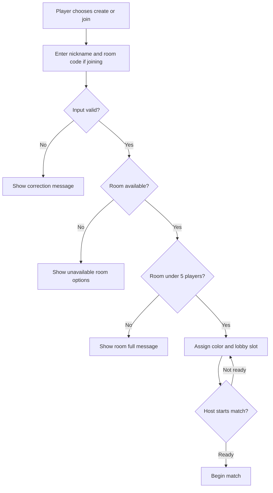
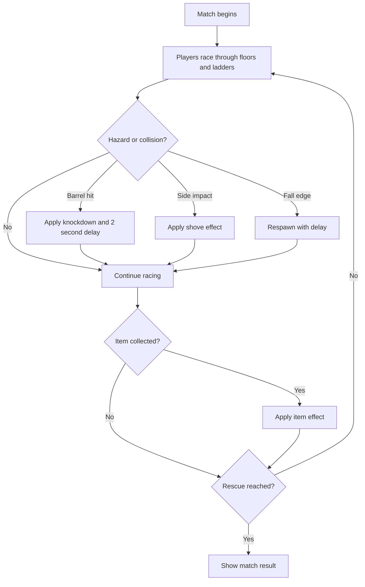
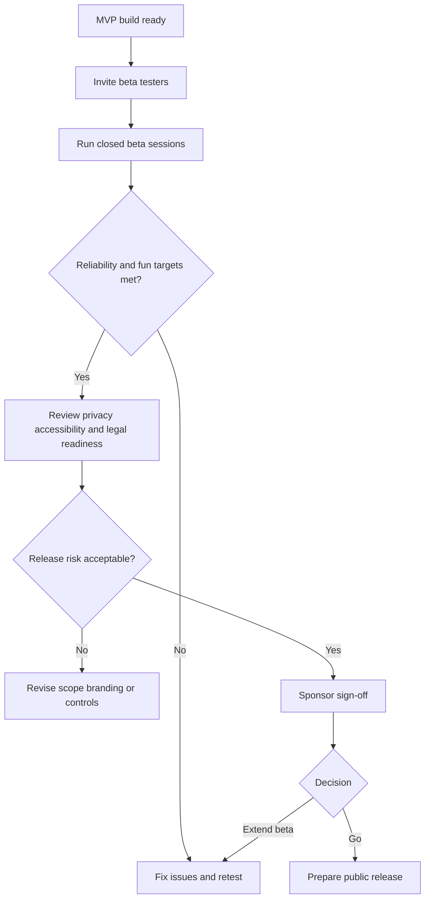
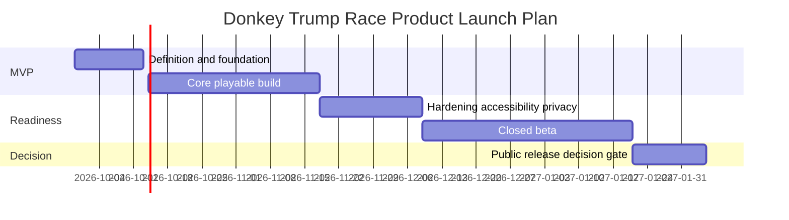

## Executive Summary

Donkey Trump Race will be a new browser-based 3D multiplayer arcade game designed for quick, humorous party play among friends. The opportunity is to deliver a lightweight, no-install competitive experience that combines recognizable arcade patterns—vertical platforming, slapstick hazards, player collisions, and comeback power-ups—into a short-session web game that users can join through a simple room code and nickname.

The initial product scope focuses on a closed-beta MVP: one playable vertical map, guest-only multiplayer lobby for up to 5 players, colored Jumpman Løkke characters, a rescue objective featuring Motzfeldt, a computer-controlled Trump-inspired boss, barrel hazards, collision shove mechanics, fall penalties, and a synchronized finish/rescue state. The experience will be built for modern browsers with a server-authoritative real-time multiplayer model so players see consistent outcomes for movement, collisions, item effects, barrel hits, and match completion.

Primary beneficiaries are casual multiplayer players, lobby hosts, and party-game audiences seeking fast, shareable entertainment. Sponsors benefit from a focused MVP that can validate fun, retention, and technical feasibility before investing in broader content, cosmetic depth, or public release.

---

## Business Objectives and Success Criteria

| Objective | How the Product Delivers | Success Criteria | Measurement Method |
|-----------|--------------------------|------------------|--------------------|
| Validate fast party-game appeal in closed beta | Players can create or join a room with a nickname and begin a short multiplayer match without account registration. | [ASSUMPTION] At least 70% of invited beta testers complete 2 or more matches within their first session by the end of beta. | Anonymous session analytics tracking invited tester starts, match completions, and repeat matches. |
| Prove the core gameplay loop is understandable | The game combines a visible rescue goal, vertical floors/ladders, hazards, collisions, and clear penalty feedback. | [ASSUMPTION] At least 80% of beta testers can complete one match without moderator assistance after one lobby join attempt. | Beta observation notes, in-game funnel events, and post-session survey responses. |
| Establish multiplayer reliability for a 5-player room | Competitive state is synchronized consistently and resolved by the server for positions, collisions, barrels, fall penalties, items, and finish state. | [ASSUMPTION] 95% of closed-beta matches with 3–5 players finish without desynchronization or forced restart. | Match telemetry comparing started rooms, completed rooms, disconnects, and server-reported error events. |
| Control MVP investment before public release | The first release limits scope to one map and P0 mechanics while deferring cosmetics, spectator polish, and larger content sets. | Closed-beta sign-off decision reached within 12 weeks of 2026-09-29 with no more than 20% scope expansion from approved MVP backlog. | Product backlog review, milestone acceptance records, and sponsor sign-off gate. |
| Meet consumer privacy and accessibility expectations | Guest-only sessions minimize personal data collection while UI and gameplay feedback include accessible states and alternatives. | 100% of user-facing menus meet WCAG 2.1 AA contrast and keyboard navigation requirements before public release consideration. | Accessibility test checklist, keyboard-only walkthrough, and screen reader review for menus and status messages. |

---

## Personas and Stakeholders

| Name | Type | Role | Goals | Pain Points | How Served |
|------|------|------|-------|-------------|------------|
| Casual Multiplayer Player | Persona | Friend joining a short online match | Join quickly, understand the objective, compete, laugh at slapstick outcomes, and finish a match in a short session. | Account creation, long setup, confusing rules, unfair collisions, and unclear penalty feedback. | Guest nickname entry, room-code joining, clear colored characters, visible rescue objective, and obvious stun/respawn feedback. |
| Lobby Host | Persona | Player who creates the room and starts the match | Invite friends, see who has joined, start only when ready, and avoid overfilled rooms. | Hard-to-share links, unknown room state, late joiners, and disconnected participants. | Room-code lobby, maximum 5-player capacity, player readiness/status display, and reconnection grace behavior. |
| Party-Game Spectator Audience | Persona | Friends watching or rotating into play | Understand who is winning and enjoy humorous collisions, barrels, and rescue moments. | Visual clutter, indistinguishable players, and unclear match outcomes. | Distinct character colors, readable hazard effects, finish/rescue announcement, and spectator-friendly presentation cues. |
| Product Sponsor | Stakeholder | Business owner funding MVP validation | Validate market interest and fun factor before investing in public launch content. | Scope creep, unclear success metrics, and legal/IP uncertainty. | Closed-beta sign-off gates, measurable adoption metrics, and explicit legal review before public release. |
| Game Development Team | Stakeholder | Designers and engineers building the game | Deliver a focused, technically feasible MVP with real-time multiplayer consistency. | Overly complex physics, unstable networking, and unclear P0/P1 boundaries. | Server-authoritative requirements, constrained player count, one-map MVP, and deferred advanced content. |
| Privacy and Compliance Reviewer | Stakeholder | Reviewer for consumer privacy and public release risk | Ensure guest play, minimal data collection, GDPR support, and legal-safe public release posture. | Unnecessary personal data, public-figure likeness risk, and unclear retention policy. | Guest-only identity, explicit GDPR scope, data retention limits, and legal/IP review gate. |

---

## User Stories and Acceptance Criteria

| ID | As a... | I want to... | So that... | Priority | Acceptance Criteria |
|----|---------|-------------|----------|----------|---------------------|
| US-001 | Casual player | open Donkey Trump Race in a modern browser | I can play without installing software | P0 | Given I use a supported modern browser, When the game loads, Then I see the title “Donkey Trump Race,” a 3D scene, and an option to create or join a room. |
| US-002 | Lobby host | create a guest room and share a room code | friends can join quickly without accounts | P0 | Given I enter an allowed nickname, When I create a room, Then a shareable room code is shown and I am assigned a visible Jumpman Løkke color. |
| US-003 | Invited player | join a lobby using a room code and nickname | I can enter my friend’s match | P0 | Given a valid room code with fewer than 5 players, When I submit an allowed nickname, Then I enter the lobby and receive a distinct Jumpman Løkke color. |
| US-004 | Invited player | receive clear feedback when joining fails | I understand how to recover | P0 | Given a room is full, expired, invalid, or already in progress, When I try to join, Then I see a clear message explaining the reason and a safe option to retry, create a new room, or return to the main screen. |
| US-005 | Lobby host | start the match when players are ready | the group can begin together | P0 | Given I am the host and at least 2 players are in the lobby, When I start the match, Then all connected players transition to the same one-map race session. |
| US-006 | Player | control a colored Jumpman Løkke through floors and ladders | I can race toward Motzfeldt while following platform rules | P0 | Given the match has started, When I move, jump, and climb, Then I can traverse floors and ladders, jump only half a floor height, cannot jump directly between floors, cannot pass the left wall, and can fall from the right edge. |
| US-007 | Player | race to rescue Motzfeldt at the top of the level | the match has a clear winning objective | P0 | Given I reach the rescue point before others, When my character touches the rescue zone, Then the match records my rescue/finish state and shows the outcome to all players. |
| US-008 | Player | encounter boss-launched barrels | the level has timed hazards and slapstick consequences | P0 | Given the computer-controlled boss launches barrels, When a barrel collides with my character, Then I am knocked down, stars are shown, and normal running is disabled for 2 seconds before control returns. |
| US-009 | Player | collide with other players and see shove effects | competition feels physical and readable | P0 | Given two player characters collide from the side, When impact is detected, Then the impacted player is visibly pushed and the same outcome is synchronized for all players. |
| US-010 | Player | fall off the right edge and respawn with a delay | mistakes have a consistent penalty without ending my match | P0 | Given I move beyond the right-side fall edge, When the fall is confirmed, Then I respawn in the playable area and receive a delay penalty comparable to barrel-hit stun. |
| US-011 | Player | collect and use power-ups | I can create comeback opportunities or disrupt opponents | P1 | Given I intersect an available item pickup, When the server awards an item, Then I can activate it on myself or opponents and the effect is applied consistently for all players. |
| US-012 | Returning player | reconnect after a short network interruption | I can recover my slot during a match | P1 | Given my connection drops briefly, When I return within the configured grace period using the same session identity, Then I regain my player slot; if the grace period expires, Then the lobby or match indicates that my slot is unavailable. |
| US-013 | Privacy-conscious player | play without a persistent account | I can enjoy the game with minimal personal data | P0 | Given I use guest play, When I enter a nickname and room code, Then no persistent account, password, MFA enrollment, or profile is required, and any collected personal data is limited and disclosed. |
| US-014 | Keyboard-only player | navigate menus and play with supported keyboard controls | I can participate without a mouse or gamepad | P0 | Given I use only a keyboard, When I navigate the landing page, lobby, and match controls, Then I can create/join a room, start if host, play the match, and read feedback without losing focus. |

---

## Business Process Overview

### 1. Guest Room Creation and Lobby Join
This process enables fast social play by allowing a host to create a room and friends to join without accounts. It is the primary entry path for the MVP and must make room capacity, readiness, and join failures clear.

**Trigger event:** A user chooses to create a room or join a shared room code.

| Step | Participants | Data Inputs | Data Outputs | Decision Points and Exceptions |
|------|--------------|-------------|--------------|--------------------------------|
| 1. Choose create or join | Player or host | Intent to host or join | Entry form shown | If the browser is unsupported, show supported-browser guidance. |
| 2. Enter nickname and optional room code | Player or host | Nickname; room code for joiners | Submitted guest identity | If nickname or room code fails allow-list validation, show corrective feedback. |
| 3. Create or locate room | Host or joiner | Valid nickname and room intent | Room code or room match result | If room does not exist, is expired, full, or already in progress, show recovery options. |
| 4. Assign color and lobby slot | Game service and players | Available color slots | Lobby roster with distinct colors | If all 5 slots are taken, joining is rejected with a full-room message. |
| 5. Host starts match | Host and all lobby players | Roster and readiness state | Match start confirmation | If minimum players are not present, host sees why start is unavailable. |

**Business outcome achieved:** Friends can form a valid multiplayer room quickly, understand room status, and begin a synchronized match.

### 2. Multiplayer Match and Rescue Gameplay
This process defines the target in-match experience: players race through a 3D vertical map, avoid boss barrels, shove opponents, collect items, and try to reach Motzfeldt. Business value comes from the readable, repeatable fun loop that testers can evaluate in short sessions.

**Trigger event:** The host starts a valid lobby match.

| Step | Participants | Data Inputs | Data Outputs | Decision Points and Exceptions |
|------|--------------|-------------|--------------|--------------------------------|
| 1. Spawn players | Players and game service | Lobby roster and assigned colors | Colored Jumpman Løkke characters placed on the map | If a player disconnects during load, reserve the slot for a grace period. |
| 2. Navigate level | Players | Movement and jump/climb inputs | Character positions and progress | Half-height jump rule prevents floor-to-floor jumping; ladders are required. |
| 3. Resolve hazards and collisions | Players, boss, game service | Barrel paths, player positions, side impacts | Stun, shove, or normal movement outcomes | Barrel hit and fall edge apply delay penalties with visible feedback. |
| 4. Apply items and power-ups | Players and game service | Item pickup and use actions | Self-benefit or opponent effect | Invalid or unavailable item use is ignored with clear feedback. |
| 5. Complete rescue objective | Players | Character reaches rescue point | Finish order and match result | If simultaneous rescue occurs, server-confirmed ordering determines the result. |

**Business outcome achieved:** Each match produces a clear winner/rescue result and enough competitive moments to validate repeat-play appeal.

### 3. Closed Beta Feedback and Public Release Sign-Off
This process governs how the product moves from MVP validation to a possible public release. It protects the sponsor from launching before fun, reliability, accessibility, privacy, and legal concerns have been reviewed.

**Trigger event:** A playable MVP build is ready for invited tester sessions.

| Step | Participants | Data Inputs | Data Outputs | Decision Points and Exceptions |
|------|--------------|-------------|--------------|--------------------------------|
| 1. Invite beta testers | Product team and testers | Invite list and beta instructions | Scheduled test sessions | If participation is too low, recruit additional testers before interpreting results. |
| 2. Run beta sessions | Testers, product team, operations | Gameplay sessions and feedback prompts | Match telemetry and survey responses | If reliability failures exceed guardrails, pause expansion and prioritize fixes. |
| 3. Review compliance and legal readiness | Compliance reviewer, legal reviewer, sponsor | Privacy approach, art/name review, accessibility evidence | Release readiness recommendation | If public-figure or IP review fails, rebrand or revise art before public launch. |
| 4. Sponsor sign-off | Sponsor and product lead | KPI results and risk report | Go, no-go, or extend-beta decision | If KPIs are not met, define a focused remediation sprint. |

**Business outcome achieved:** The product advances only when the MVP meets measurable quality, privacy, accessibility, and release-readiness gates.

---

## Business Rules and Policies

| Rule | When It Applies | User Experience | Example |
|------|-----------------|-----------------|---------|
| Guest-only identity | Every initial-release session | Players enter a nickname and room code only; no account, password, persistent profile, or MFA flow is required. If a guest session expires, the player must rejoin with a new valid session. | A player named “LarsFan” joins room “A7K2Q”; if the room expires after the session, that nickname is not reserved. |
| Room capacity limit | A player attempts to join a lobby | A room accepts no more than 5 human players. If full, the joiner sees a clear full-room message and can create another room or retry later. | The sixth user entering a valid code is told the room is full and is not added as a hidden participant. |
| Nickname and room-code validation | A player submits guest identity information | Nicknames and room codes are validated using allow-listed characters and length limits; rejected input receives a safe, actionable correction message. | A nickname containing unsupported symbols is rejected with “Use letters, numbers, spaces, hyphen, or underscore.” |
| Distinct player colors | A player enters a lobby | Each player receives a clearly distinguishable Jumpman Løkke color. If no colors remain, the room is treated as full. | Five players receive five distinct colors; a sixth user cannot join. |
| Movement and level boundaries | During the match | Players can jump, climb ladders, and move across platforms, but cannot jump directly from one floor to another, cannot pass the left wall, and can fall from the right edge. | A player trying to jump from floor 1 to floor 2 fails and must use a ladder. |
| Barrel-hit penalty | A barrel collides with a player | The player is knocked down, stars are displayed, and normal running is unavailable for exactly 2 seconds. If multiple hits occur during the penalty, the user receives clear feedback and the server-confirmed penalty state applies. | A player hit by a barrel at 00:45 resumes normal running at 00:47. |
| Fall-off-edge penalty | A player falls from the right edge | The player respawns in a safe playable location and receives a delay comparable to barrel stun. If respawn placement is unsafe, the system chooses a safe fallback position. | A player falls off the right side and returns to the last safe floor after the delay. |
| Server-authoritative fairness | Any competitive in-match outcome occurs | The server-confirmed outcome determines positions, item effects, collisions, barrel hits, fall penalties, and rescue order. If a client display disagrees, it is corrected without exposing technical details to the user. | Two players reach Motzfeldt almost together; the final result follows the server-confirmed order. |
| GDPR minimal-data handling | Any personal or session data is collected | The product collects only what is necessary for guest play, provides privacy notice for cookies/telemetry, supports data-rights requests, masks personal data in logs, and purges room/session data on a defined schedule. | A tester requests access to their beta feedback; the team can retrieve or erase applicable records. |
| Accessibility baseline | Any user-facing screen or status is delivered | Menus and feedback states must meet WCAG 2.1 AA, including keyboard navigation, screen reader-compatible labels for menus, and sufficient color contrast beyond color-only identification. | A colorblind player can identify their character through both color and label/icon cues. |
| Legal/IP review gate | Before any public release | Public use of character names, likenesses, and branding must pass legal/IP review; if rejected, public-facing art or names must be revised before launch. | If a reviewer flags a public-figure likeness risk, beta art is replaced or stylized before release. |
| Internationalization position | Initial release and future planning | The initial release may use one primary interface language, but names and UI text must support Danish characters and locale-safe display. Broader localization and right-to-left layouts are future considerations unless sponsors approve earlier. | “Jumpman Løkke” displays correctly in menus and match results. |

---

## Success Metrics and KPIs

### Primary Metrics
| Metric | Target | Measurement Method | Timeline | Business Impact |
|--------|--------|--------------------|----------|-----------------|
| Closed-beta match completion rate | [ASSUMPTION] At least 80% of started beta matches reach a rescue/finish result | Anonymous match telemetry | By beta exit gate | Demonstrates the core loop is playable and stable enough for broader testing. |
| Repeat-match rate | [ASSUMPTION] At least 70% of invited testers play 2 or more matches in their first session | Session analytics by invited tester cohort | Within 8 weeks of 2026-09-29 | Indicates short-session replay value and party-game appeal. |
| Multiplayer room success rate | [ASSUMPTION] At least 90% of attempted valid room joins succeed within 10 seconds | Lobby funnel analytics | By MVP validation milestone | Confirms low-friction social onboarding. |

### Secondary Metrics
| Metric | Target | Measurement Method | Timeline | Business Impact |
|--------|--------|--------------------|----------|-----------------|
| Objective comprehension | [ASSUMPTION] At least 80% of surveyed testers correctly identify “reach Motzfeldt” as the goal after one match | Post-session survey | During closed beta | Confirms the game objective is clear without lengthy onboarding. |
| Average match duration | [ASSUMPTION] Median match length between 2 and 5 minutes | Match start/end telemetry | During closed beta | Supports short party-game sessions and rapid replay. |
| Accessibility menu coverage | 100% of landing, lobby, error, and result screens keyboard-navigable | Accessibility test checklist | Before beta sign-off | Ensures inclusive access to core flows. |

### Guardrail Metrics
| Metric | Target | Measurement Method | Timeline | Business Impact |
|--------|--------|--------------------|----------|-----------------|
| Match-breaking error rate | Less than 2% of beta matches end due to unrecoverable error | Error and match outcome telemetry | Throughout beta | Prevents unstable sessions from undermining tester confidence. |
| Desynchronization rate | Less than 5% of matches show server-reported state correction above acceptable threshold | Multiplayer telemetry | Throughout beta | Protects fairness and perceived legitimacy. |
| Join failure due to invalid UX | Less than 10% of room-join attempts fail after a user has a valid invite | Lobby funnel analytics | By beta exit gate | Keeps social onboarding friction low. |
| Privacy incident count | 0 confirmed incidents involving exposed personal data or unapproved persistent identifiers | Privacy review and incident log | Through public-release gate | Protects GDPR posture and launch readiness. |
| Legal/IP launch blocker count | 0 unresolved public-release blockers at sign-off | Legal/IP review checklist | Before public release consideration | Prevents avoidable reputational or legal risk. |

---

## Risks Assumptions Dependencies and Constraints

### Risks
| Risk | Probability | Business Impact | Trigger Conditions | Mitigation | Owner |
|------|-------------|-----------------|-------------------|------------|-------|
| Core gameplay is not fun enough for repeat play | Medium | Low repeat-match rate could stop investment before public release. | Repeat-match rate below 70% or tester survey sentiment below target. | Run focused beta playtests, adjust movement speed, hazard frequency, and item balance before expanding content. | Product Lead and Game Designer |
| Real-time multiplayer feels unfair or inconsistent | Medium | Players may abandon matches if collisions, items, or finish order appear wrong. | Desynchronization above 5% of matches or repeated finish-order disputes. | Use server-authoritative match outcomes, limit rooms to 5 players, and prioritize network telemetry in beta. | Engineering Lead |
| Legal/IP review blocks public branding | High | Public launch may require rework of art, names, or marketing materials. | Legal review flags public-figure likeness, game inspiration, or naming risk. | Keep beta assets stylized, avoid copyrighted assets, and schedule legal/IP review before public release planning. | Product Sponsor and Legal Reviewer |
| Accessibility gaps reduce inclusivity and policy readiness | Medium | Users with assistive needs may be unable to navigate menus or understand feedback. | Keyboard-only test fails or color contrast/readability issues found. | Test menus, lobby, errors, and result screens against WCAG 2.1 AA before beta exit. | UX Lead |
| Team capacity expands beyond MVP | Medium | Scope creep could delay closed beta and reduce learning speed. | Backlog grows more than 20% beyond P0 scope or adds multi-map/cosmetic features before beta. | Enforce P0 scope, move enhancements to future consideration, and review weekly with sponsor. | Product Lead |
| GDPR or data retention design is incomplete | Low | Privacy review could block broader testing or public release. | No documented privacy notice, cookie disclosure, retention schedule, or data-rights handling. | Use guest-only identity, minimize data collection, define retention windows, and validate with compliance reviewer. | Compliance Reviewer |

### Assumptions
| Assumption | Impact if Wrong | Validation Plan |
|------------|-----------------|-----------------|
| [ASSUMPTION] A browser-based WebGL experience will perform acceptably for the invited tester hardware profile. | If false, the MVP may require reduced visual complexity, narrower device support, or engine optimization before beta expansion. | Capture device/browser performance during beta and set minimum supported browser/device guidance. |
| [ASSUMPTION] Guest-only rooms are sufficient for the initial social gameplay loop. | If false, persistent identity, moderation, or friend systems may be required, increasing privacy and build scope. | Survey testers on rejoin, identity, and abuse-prevention needs after beta sessions. |
| [ASSUMPTION] One playable map is enough to validate fun and retention. | If false, low repeat play may reflect content scarcity rather than core mechanics. | Ask testers whether they stopped due to boredom, confusion, or technical issues; avoid adding maps until core loop is validated. |
| [ASSUMPTION] The parody/cartoon direction can pass legal/IP review with revisions if needed. | If false, public launch could require rebranding or substantial character redesign. | Conduct legal/IP review before any public marketing or GA commitment. |

### Dependencies
| System/Team | Dependency | Timeline | Impact if Delayed |
|-------------|------------|----------|-------------------|
| Game Design | Final movement tuning, ladder rules, item balance, and hazard cadence | Weeks 1–4 from 2026-09-29 | Match loop may feel confusing or unfair. |
| Engineering | Browser 3D client, real-time game server, room/lobby flow, and telemetry | Weeks 1–10 from 2026-09-29 | Closed beta cannot start or will lack measurable reliability evidence. |
| Art/Creative | Stylized characters, boss, Motzfeldt, barrels, level readability, and non-copyrighted assets | Weeks 2–8 from 2026-09-29 | Gameplay may be functional but not understandable or legally reviewable. |
| UX/Accessibility | Keyboard navigation, readable feedback states, color contrast, and menu flows | Weeks 4–10 from 2026-09-29 | Beta sign-off may fail accessibility expectations. |
| Legal/Compliance | GDPR review, cookie/privacy notice, and legal/IP review for names and likenesses | Weeks 8–12 from 2026-09-29 | Public release decision may be blocked. |

### Constraints
| Constraint | Type | Impact |
|------------|------|--------|
| Initial match capacity is capped at 5 human players | Technical | Simplifies synchronization and protects MVP feasibility. |
| Initial identity model is guest-only room code and nickname | Business | Reduces onboarding friction but limits persistence, moderation, and long-term progression. |
| GDPR is the only in-scope regulatory framework for initial release | Regulatory | Requires privacy notice, data minimization, cookie/telemetry disclosure, rights handling, and retention rules. |
| Public release requires explicit closed-beta sign-off | Business | Prevents launch until fun, reliability, accessibility, privacy, and legal readiness are reviewed. |
| One playable map is P0 | Resource | Keeps MVP focused but may limit replay depth during beta. |
| No copyrighted Nintendo assets or unreviewed real-person likenesses for public release | Regulatory | Requires original/stylized art direction and legal review. |

---

## Scope NFRs and Open Questions

### In Scope
- Browser-based 3D web game titled “Donkey Trump Race.”
- One playable MVP map with vertical floors, ladders, left-side wall, and right-side fall edge.
- Mario Kart-style third-person game feel and readable 3D presentation.
- Guest-only room-code and nickname lobby for up to 5 human players.
- Distinct colored Jumpman Løkke characters for each joined player.
- Motzfeldt rescue objective at the top of the level.
- Computer-controlled Trump-inspired boss positioned on the right side and launching barrel hazards.
- Barrel hit knockdown, stars, and exactly 2-second normal-movement delay.
- Right-edge fall respawn with comparable delay penalty.
- Player-to-player side collision and shove mechanics.
- MVP item/power-up framework with at least self-benefit and opponent-affecting item behavior.
- Closed-beta telemetry, feedback collection, and release sign-off gate.

### Out of Scope
- More than 5 simultaneous human players.
- Persistent accounts, passwords, MFA enrollment, user profiles, or long-term progression.
- Native mobile apps.
- Full single-player campaign beyond any internal test mode.
- Multiple launch maps as P0 scope.
- Exact copyrighted Nintendo assets, music, level layouts, or branding.
- Public use of real-person names or likenesses without legal/IP review.
- Complex realistic vehicle simulation.

### Future Consideration
- Additional maps and hazards.
- Expanded cosmetic customization and character skins.
- Spectator enhancements and party-room presentation modes.
- More item types, comeback balancing, and advanced power-up strategy.
- Optional localization beyond the initial language.
- Persistent accounts or progression if validated by demand and privacy review.
- AI fill-in players for underfilled rooms.
- Binary or compressed real-time messages after protocol stabilization.

### Non-Functional Requirements
- **Performance:** Initial landing and lobby experience should become usable within 3 seconds on supported broadband connections [ASSUMPTION]. Room join should complete within 10 seconds for valid rooms. In-match state updates should target a responsive multiplayer feel with server snapshots at least 10 times per second and typical end-to-end gameplay latency under 150 ms for supported regions [ASSUMPTION].
- **Security:** All user-submitted nicknames, room codes, and gameplay inputs must be validated server-side using allow lists and bounds. The server must determine competitive outcomes and must not trust client-reported final positions, item effects, collisions, hazard hits, or finish state. User-facing errors must not expose stack traces, secrets, or internal implementation details.
- **Accessibility:** User-facing menus, lobby, status messages, error states, and result screens must meet WCAG 2.1 AA. Required coverage includes keyboard navigation, visible focus, readable contrast, screen reader-compatible menu/status labels, and non-color-only player identification.
- **Scalability:** MVP must support 5-player rooms and closed-beta concurrency [ASSUMPTION: up to 20 simultaneous rooms during invited testing]. Architecture should allow later horizontal scaling if beta demand exceeds the invited-test plan.
- **Compliance:** GDPR is in scope for consumer privacy, cookies/telemetry, data minimization, data-rights handling, retention, and deletion. SOC 2, HIPAA, PCI-DSS, SOX, and CCPA are not treated as applicable for the initial guest-only consumer game unless future monetization, accounts, healthcare, payment, enterprise, or California-specific obligations are introduced.
- **Reliability and Observability:** The system must record non-sensitive operational events for room creation, match start/end, disconnects, join failures, match-breaking errors, and beta sign-off reporting. Logs must mask personal data and avoid storing unnecessary identifiers.
- **Internationalization:** Initial release may use a single interface language, but the product must correctly display Unicode names such as “Løkke” and “Motzfeldt.” Full multi-language and right-to-left support are future considerations.

### Open Questions
- Product Sponsor: What is the exact closed-beta invite size and geographic region for latency targets?
- Game Designer: What are the initial item types and balancing rules for the MVP item system?
- UX Lead: What exact keyboard/gamepad/control scheme will be supported at beta launch?
- Creative Lead and Legal Reviewer: Which public-facing names and likenesses are approved for beta versus public release?
- Engineering Lead: Should the MVP use Three.js or Babylon.js as the rendering engine, and raw WebSockets or Socket.IO for networking?
- Product Sponsor: What is the desired public-release success threshold after closed beta?

---

## Rollout Plan

1. **Phase 1 — MVP Definition and Prototype Foundation**
   - **Timeline:** 2026-09-29 to 2026-10-13
   - **Description:** Confirm the playable MVP boundaries, choose the rendering/networking stack, and define the one-map gameplay model.
   - **Key milestones and deliverables:** Approved P0 backlog; initial interaction model; technical architecture decision; legal/IP review checklist opened.
   - **Dependencies:** Product sponsor, game design, engineering, creative direction.
   - **Success gate:** MVP scope remains limited to one map, 5-player lobby, movement/collisions, barrels, rescue objective, and essential feedback states.
   - **Owner:** Product Lead

2. **Phase 2 — Core Playable Build**
   - **Timeline:** 2026-10-14 to 2026-11-17
   - **Description:** Build the first playable end-to-end loop: create/join room, assign colors, start match, traverse the vertical map, encounter barrels, collide, fall/respawn, and complete the rescue objective.
   - **Key milestones and deliverables:** Playable browser build; one map; colored Jumpman Løkke characters; Motzfeldt objective; boss barrel hazards; 2-second stun; fall penalty; match result screen.
   - **Dependencies:** Engineering, game design, art/creative assets.
   - **Success gate:** Internal playtest completes 10 consecutive matches with no unrecoverable match blocker [ASSUMPTION].
   - **Owner:** Engineering Lead

3. **Phase 3 — Multiplayer Hardening, Accessibility, and Privacy Readiness**
   - **Timeline:** 2026-11-18 to 2026-12-08
   - **Description:** Stabilize room behavior, reconnect handling, input validation, telemetry, privacy notices, and user-facing error states before invited testing.
   - **Key milestones and deliverables:** Room full/invalid/expired states; keyboard navigation; WCAG 2.1 AA menu review; GDPR notice and retention plan; beta telemetry dashboard; accessibility fixes.
   - **Dependencies:** UX/accessibility, compliance reviewer, engineering, product analytics.
   - **Success gate:** 100% of core menu/lobby/result screens pass keyboard-navigation review, and privacy/compliance reviewer approves beta data collection.
   - **Owner:** UX Lead and Compliance Reviewer

4. **Phase 4 — Closed Beta with Invited Testers**
   - **Timeline:** 2026-12-09 to 2027-01-20
   - **Description:** Run invited sessions, collect match telemetry and qualitative feedback, and tune the core loop without expanding beyond the approved MVP.
   - **Key milestones and deliverables:** Beta invite plan; tester onboarding instructions; session telemetry; survey results; prioritized fix backlog; item/collision tuning recommendations.
   - **Dependencies:** Product lead, operations, tester recruitment, engineering support.
   - **Success gate:** At least 80% match completion, at least 70% repeat-match rate among invited testers, less than 2% match-breaking error rate, and no unresolved privacy or accessibility blocker.
   - **Owner:** Product Lead

5. **Phase 5 — Public Release Decision Gate**
   - **Timeline:** 2027-01-21 to 2027-02-04
   - **Description:** Evaluate beta outcomes, legal/IP readiness, privacy posture, accessibility evidence, and technical reliability to decide whether to proceed, extend beta, or revise branding/scope.
   - **Key milestones and deliverables:** Go/no-go recommendation; legal/IP review result; KPI summary; risk register update; public-release remediation plan if needed.
   - **Dependencies:** Product sponsor, legal reviewer, compliance reviewer, engineering lead, creative lead.
   - **Success gate:** Sponsor signs off explicitly before any public release activity begins.
   - **Owner:** Product Sponsor

